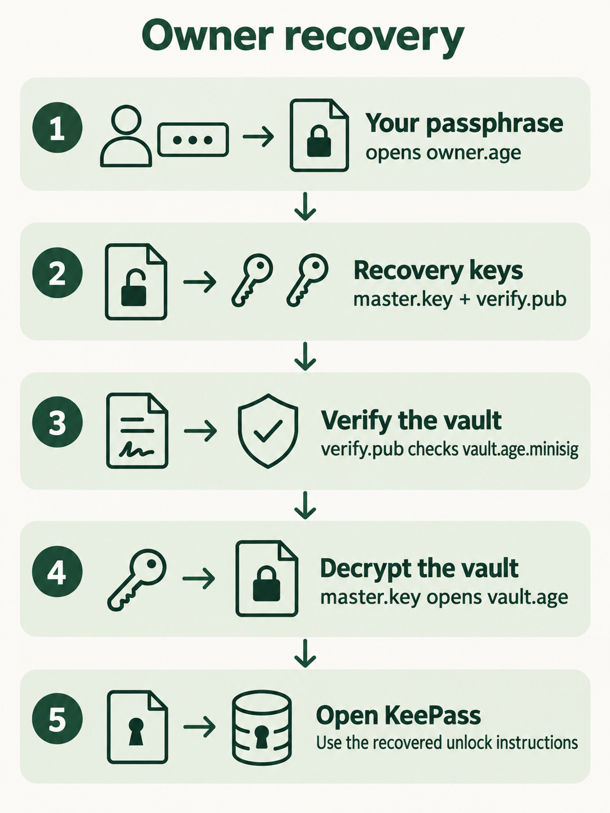
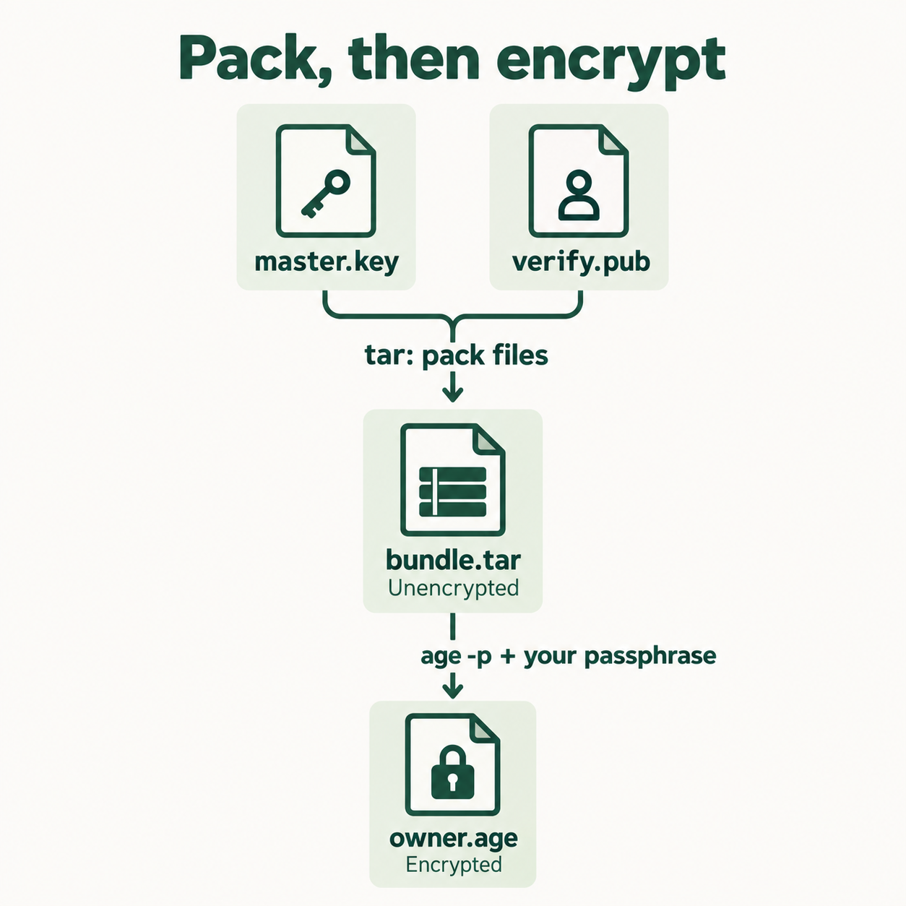
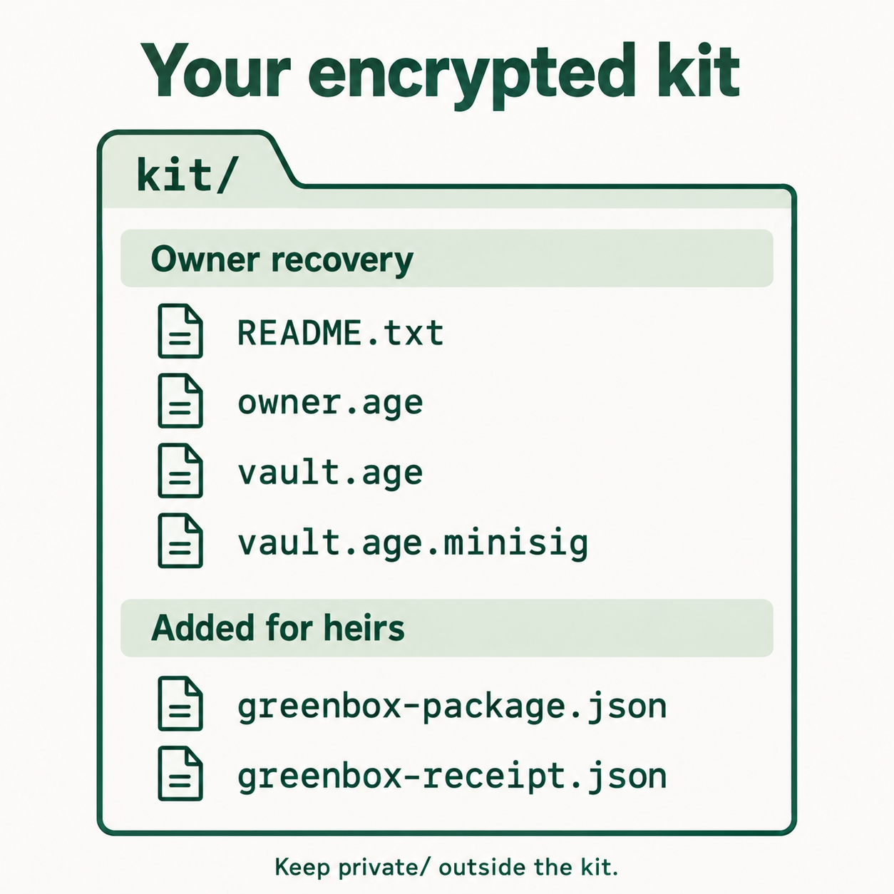

# Create and verify Greenbox

Current owner setup and wallet/Shamir recovery reference. Follow the steps in order, one command at a time. For the shorter guided version, open the [handbook](../../index.html#owner). Project paths were updated on 25 September 2026.

## Understand what you are building first

Greenbox has two encrypted packages:

| Package | What is inside | How you open it |
|---|---|---|
| `owner.age` | The key that opens your backup, plus the public key that checks its signature | Your memorized Greenbox passphrase |
| `vault.age` | Your KeePass database copy and the information needed to open that database | The encryption key recovered from `owner.age` |

There is also a signature file, `vault.age.minisig`. Checking it tells you whether the backup was signed with your signing key and has remained unchanged. It does not decrypt anything.

The owner’s recovery sequence is:



Step 4 adds the wallet route: any three of five custodians recover the same bundle without your Greenbox phrase. See the [protocol](PROTOCOL.md) for its security and hardware assumptions.

Three terms used below:

- **Archive:** a file containing other files. `tar` makes an archive. It adds no password and performs no encryption.
- **Encryption:** makes the contents unreadable without the appropriate key or passphrase. `age` does this.
- **Signature:** lets you check that a file was signed by the holder of a particular signing key. `minisign` does this.

## 1. Prepare the tools and create the folders

Open Terminal and check the tools:

```sh
age --version
age-keygen --help
minisign -v
```

The age help should list `-pq`. Installation: [age](https://github.com/FiloSottile/age) · [minisign](https://jedisct1.github.io/minisign/).

Create your working folders:

```sh
mkdir -m 700 "$HOME/greenbox-backup" &&
cd "$HOME/greenbox-backup" &&
umask 077 &&
mkdir -p private/bundle private/payload kit
```

`private/` holds your keys and working files. `kit/` will hold the encrypted backup. The permissions keep new files private to your account.

**Keep this Terminal window open and stay in this folder for the following steps.**

[Offline preparation notes](#offline-preparation-notes).

## 2. Put the files you want to back up into `private/payload/`

Save and close KeePass. Copy its database into `private/payload/` and add these files:

| File | What to put in it |
|---|---|
| Your `.kdbx` database copy | Your saved password-manager database |
| `UNLOCK.txt` | Which application opens it, the database password, and any additional unlock requirements |
| `BACKUP-INFO.txt` | Backup date, release number beginning at 1, and a recent entry/attachment you will inspect after recovery |
| The matching key file, if required | The exact key file that opens this database copy |

`UNLOCK.txt` is secret. It stays inside `private/` until it is encrypted into `vault.age`.

The KeePass password and the Greenbox passphrase serve different purposes. Recovering Greenbox must also let you open its KeePass copy, especially if you are unavailable. That is why the database’s unlock information is included inside the outer encrypted backup.

If KeePass requires a hardware token or a particular computer account, first make and test a supported recovery copy that does not depend on the lost hardware. Do not change the live database’s protection merely to follow this guide. KeePass needs all the master-key components configured for the database. [KeePass master keys](https://keepass.info/help/base/keys.html)

## 3. Create the small package that your passphrase will open

**Purpose of this entire step:** create `kit/owner.age`. Later, your Greenbox passphrase will open that file and recover the two files needed to verify and decrypt your backup.

This step does not encrypt the KeePass database yet. That happens in step 5.

### Before typing commands: the four key files

| File | What it does | Secret? |
|---|---|---|
| `private/bundle/master.key` | Decrypts the backup | Yes |
| `private/master.recipient` | Encrypts files for that master key | No; it is the matching public encryption key |
| `private/sign.key` | Signs backups you create | Yes; additionally protected with a password |
| `private/bundle/verify.pub` | Checks those signatures | No; it is the matching public verification key |

The first two belong to the **age encryption pair**. The last two belong to a separate **minisign signing pair**.

The encryption pair keeps the backup private. Anyone who knows its public recipient can create a different encrypted file that your master key can open, so successful decryption alone does not prove you created the file. The signing pair lets you check that it was signed with your signing key.

We put only `master.key` and `verify.pub` in the recovery package because reading a backup requires decrypting it and checking its signature. The signing key is needed to create signed backups, so it is kept separately.

`verify.pub` is public, but its source must be trusted. Recovering it from your passphrase-protected package prevents someone from simply supplying their own replacement verification key beside a replacement backup.

### Which password will you enter?

Use one chosen **Greenbox passphrase** for both password prompts in this setup:

| Command | Why it asks for a password | What you enter |
|---|---|---|
| `minisign -G ...` | Protects the newly generated `sign.key` file | Your chosen Greenbox passphrase, twice |
| `age -p ...` | Encrypts `bundle.tar` into `owner.age` | The same Greenbox passphrase, twice |

These are separate protections using the same phrase by your choice. The tools do not connect them automatically. There is no new password for the tar archive, and the generated encryption key is not a password you must memorize.

Choose 12 random words using five fair dice per word and the [EFF long wordlist](https://www.eff.org/dice).

Keep the temporary written phrase secure while learning it. Do not destroy it before both recovery paths work and you can recall it reliably. Enter actual secret words only into the trusted local password prompts, never into chat, a website, or a shell command. Password entry is hidden; seeing no characters as you type is normal.

### 3a. Generate the private encryption key

The folder `private/bundle/` must already exist. This command creates `master.key` inside it:

```sh
age-keygen -pq -o private/bundle/master.key
```

- `age-keygen`: generate an age encryption key.
- `-pq`: choose hybrid post-quantum encryption.
- `-o private/bundle/master.key`: write the generated secret key to this file.

**What happens:** age generates a random key and prints its public recipient to the terminal. It does not ask for a password. The saved `master.key` is currently unencrypted and secret.

### 3b. Export its public encryption key

This command reads the key from 3a and writes its corresponding public key into a separate file:

```sh
age-keygen -y -o private/master.recipient private/bundle/master.key
```

- `-y`: derive/export the public recipient from an existing private key.
- `-o private/master.recipient`: save the public key here.
- `private/bundle/master.key`: read this existing secret-key file as input.

**What happens:** `private/master.recipient` is created without a password prompt. No new independent key pair is generated. This public key can encrypt backups but cannot open them. It lets you create backups without using the private decryption key for the encryption operation.

### 3c. Generate the separate signing key pair

```sh
minisign -G -p private/bundle/verify.pub -s private/sign.key
```

- `minisign`: the signature tool.
- `-G`: generate a new signing key pair.
- `-p private/bundle/verify.pub`: save the public verification key here.
- `-s private/sign.key`: save the secret signing key here.

**What happens:** minisign asks you to choose and confirm a password protecting `sign.key`. Enter the Greenbox passphrase chosen above. It then creates both files.

**The flags are tool-specific:** lowercase `-p` means a public-key file in minisign, but password encryption in age. This minisign command does not encrypt your archive or database.

Keep the password-protected `sign.key` on owner-controlled offline storage, outside the public kit.

### 3d. Package the two recovery files together

At this point these two files must exist:

```text
private/bundle/master.key
private/bundle/verify.pub
```

Check their presence without displaying their contents:

```sh
ls -l private/bundle/master.key private/bundle/verify.pub
```

`ls -l` lists each file’s name, size, and permissions. If either is missing, stop and check your working folder and the preceding steps.

Now package them into one archive:

```sh
tar -cf private/bundle.tar -C private/bundle master.key verify.pub
```

- `tar`: package files together.
- `-c`: create an archive.
- `-f private/bundle.tar`: write the archive to this filename.
- `-C private/bundle`: look for the following input files inside this folder, for this command only. Your terminal stays in the original working folder.
- `master.key verify.pub`: include exactly these two files.

**What happens:** a new file, `private/bundle.tar`, is created. The two original files remain in place. No password is requested. The archive is still unencrypted and secret because it contains `master.key`.

Check the archive’s list of filenames:

```sh
tar -tf private/bundle.tar
```

`-t` lists the contents; `-f` names the archive to inspect. It does not extract the files or display their contents. The expected listing is:

```text
master.key
verify.pub
```

### 3e. Encrypt the archive with your Greenbox passphrase

This is the operation that creates `owner.age`:



Before encrypting, verify the input and make sure the output folder exists:

```sh
ls -l private/bundle.tar
mkdir -p kit
```

The first command must list the archive. The second creates the `kit` folder if it is missing. **`kit/owner.age` itself does not need to exist. Do not make an empty file with that name.**

Now run:

```sh
age -p -o kit/owner.age private/bundle.tar
```

- `age`: the encryption tool; encryption is the default operation.
- `-p`: encrypt using a passphrase you enter at the prompt.
- `-o kit/owner.age`: create the encrypted output at this path.
- `private/bundle.tar`: read this existing archive as input.

**What happens:** age asks for the Greenbox passphrase and its confirmation, then writes `kit/owner.age`. Enter the same chosen phrase, not another newly invented password. The original unencrypted archive remains under `private/`.

If the prompt offers to generate a passphrase when left empty, type your chosen phrase instead. This step is protecting the archive with the phrase you already selected.

If `owner.age` already exists from a successful attempt, skip encryption and verify it below. Age can overwrite output files; do not rerun creation commands over good copies just to repeat a step.

### 3f. Check that your phrase opens the package

Decrypt the encrypted copy into a separate check file:

```sh
age -d -o private/owner-check.tar kit/owner.age
```

- `-d`: decrypt.
- `-o private/owner-check.tar`: save the decrypted result here, leaving the original archive intact.
- `kit/owner.age`: read this encrypted file.

Enter the same Greenbox passphrase once. Now compare the recovered archive with the original:

```sh
cmp private/bundle.tar private/owner-check.tar
```

`cmp` compares their bytes. **No output and a successful exit mean they match.** An error or a difference means stop and investigate. You have now proved that your phrase recovers the original package.

Step 3 is complete when `owner.age` decrypts successfully and the comparison matches. You have created recovery keys and their password-protected package. You have not yet encrypted the password-manager backup.

## 4. Add the wallet/Shamir custodian route

For the optional 3-of-5 wallet route, follow the [heirs guide](../../index.html#heirs). Start the local tool in a separate Terminal window using the [startup instructions](../../index.html#help!the-local-tool-will-not-open). Keep this owner Terminal in its working folder. The creator collects reusable public cards; any three custodians can recover in any order.

Use the following choices when the tutorial asks what to protect:

| Tutorial field or output | For this full Greenbox kit |
|---|---|
| Recovery rule | 3 of 5 |
| File to protect | `private/bundle.tar` from step 3d |
| Encrypted output | Download `greenbox-package.json` and copy it into `kit/` |
| Public receipt | Download its matching `greenbox-receipt.json` and copy it into `kit/`; also deliver a trusted copy directly to custodians |
| Recovery result | The original `bundle.tar`, containing `master.key` and `verify.pub` |

Do not select `owner.age`: doing so would make custodians need your owner passphrase after recovery. Do not select a `.kdbx` if you intend this route to open the complete existing `vault.age`; direct database protection recovers only that database and still requires its own unlock information.

Use your file manager to place the two downloaded JSON files in this workspace's `kit/` folder. Keep the matching pair from the same creation. Public cards can be retained with the recovery materials. Keep the trusted local HTML tool and its guide too. Do not copy `bundle.tar`, raw keys, or released secret shares into the public kit.

The creator does not need to connect a wallet to encrypt the bundle. On a future offline setup, bring the **public** cards to the prepared encryption machine and build the package there using the trusted local page. Do not move a real plaintext bundle onto an online computer just to use a browser. Rehearse the browser and tool availability in that offline environment first; this has not been physically tested in Tails.

A receipt stored beside the package is only a copy. Custodians must have a separately trusted receipt; accepting a replacement package plus its replacement receipt is not creator authentication. Their trusted receipt binds the recovered bundle and therefore the `verify.pub` inside it.

## 5. Encrypt and sign the actual password-manager backup

You are still in the owner’s original working folder. The input is the completed `private/payload/` folder from step 2.

First package the payload:

```sh
tar -cf private/payload.tar -C private payload
```

This creates `private/payload.tar`, containing the `payload/` folder and its files. As in 3d, `tar` only packages files. It asks for no password and leaves the originals in place.

Encrypt that archive:

```sh
age -R private/master.recipient -o kit/vault.age private/payload.tar
```

`-R` reads your public encryption key from `private/master.recipient`. The command reads `private/payload.tar` and creates encrypted `kit/vault.age`. It asks for no password. The matching secret `master.key` will decrypt it later.

Sign the encrypted file:

```sh
minisign -S -s private/sign.key -m kit/vault.age
```

- `-S`: sign a file.
- `-s private/sign.key`: use this secret signing key.
- `-m kit/vault.age`: sign this encrypted backup.

Enter the password you chose for minisign in 3c. This unlocks the signing key; it does not add another password to the backup. Minisign creates `kit/vault.age.minisig`. The encrypted backup itself stays unchanged.

Finally, create a public instruction file. The following command writes the text between the two `TEXT` markers into `kit/README.txt`. Copy the whole block; it contains no secrets:

```sh
cat > kit/README.txt <<'TEXT'
GREENBOX RECOVERY KIT
Tools: age with PQ support and minisign, from their official projects.
https://github.com/FiloSottile/age
https://jedisct1.github.io/minisign/
Never send recovery words or plaintext keys to a remote service.

OWNER: Decrypt owner.age locally with the Greenbox passphrase.
The resulting tar archive contains master.key and verify.pub.
Use verify.pub to check vault.age.minisig against vault.age.
Only after verification, decrypt vault.age with master.key.
Extract that archive and read payload/UNLOCK.txt.

WALLET CUSTODIANS (only if the matching JSON files are included):
Use a trusted copy of the Greenbox wallet recovery page.
Load greenbox-package.json and your independently trusted receipt.
Any three of the five registered accounts can release their shares.
Combine those secret shares in any order to recover bundle.tar.
Extract master.key and verify.pub, verify vault.age, then decrypt it.
This prototype is not independently audited or post-quantum.
Retain the complete recovery guide and trusted HTML tool separately.
TEXT
```

The owner kit has four required files. If you completed the wallet rehearsal in step 4, add its two matching JSON files:



Do not upload `private/`. It contains the plaintext keys, archives, and password-manager unlock information.

## 6. Recover it and prove the backup works

### First, test the owner’s path

For the initial test, stay in the original working folder. Create a new folder for recovered files:

```sh
mkdir -m 700 restored
```

Decrypt the owner’s package:

```sh
age -d -o restored/bundle.tar kit/owner.age
```

Enter the Greenbox passphrase. This writes the unencrypted recovery archive into `restored/`.

Inspect its list of filenames:

```sh
tar -tf restored/bundle.tar
```

It must list only `master.key` and `verify.pub`. Also inspect file types:

```sh
tar -tvf restored/bundle.tar
```

`-v` adds details. Both entries must be regular files (lines starting with `-`), not links or directories. If names or types are unexpected, stop. Extract only those two files:

```sh
tar -xf restored/bundle.tar -C restored master.key verify.pub
```

`-x` means extract, `-f` names the input archive, and `-C restored` puts the extracted files in `restored/`. No password is requested.

Check the encrypted backup’s signature:

```sh
minisign -Vm kit/vault.age -p restored/verify.pub
```

`-V` means verify; `-m` identifies the signed file; `-p` identifies the public verification key. Minisign reads the matching `vault.age.minisig` signature file automatically. The command must report successful verification before you continue. It asks for no password.

This public key came from the package successfully opened with your phrase. Do not replace it with a different key downloaded beside the backup.

Decrypt the actual backup:

```sh
age -d -i restored/master.key -o restored/payload.tar kit/vault.age
```

`-i` supplies the recovered secret decryption key. The command reads `kit/vault.age` and writes `restored/payload.tar`. It asks for no password because you have already recovered the key.

Inspect, then extract:

```sh
tar -tf restored/payload.tar
```

Confirm that the listing contains your expected files under `payload/`. Use the detailed listing to inspect file types:

```sh
tar -tvf restored/payload.tar
```

Only expected directories (`d`) and regular files (`-`) should be present. Stop for absolute paths, `..` path components, links, special files, or unexpected programs. After this check, run:

```sh
tar -xf restored/payload.tar -C restored
```

Your recovered password-manager files are now under `restored/payload/`.

During the initial test in the original working folder, compare them with the originals:

```sh
diff -rq private/payload restored/payload
```

`-r` compares folders recursively; `-q` reports differences without printing file contents. No output and a successful exit mean the contents match. During a real recovery the originals may be lost, so this comparison is only for setup/testing when the original `private/payload/` is available.

**The final check is opening the recovered KeePass database using only the recovered unlock information.** Inspect the recent entry and attachment recorded in `BACKUP-INFO.txt`. Do not save changes into the recovered test copy before comparing it.

### Then test the wallet custodian path

Use [the custodian recovery guide](../../index.html#recover-heirs). Three custodians load the same package and their independently trusted receipt, sign the saved message, and privately release their individual shares. The recovering person combines them and downloads `bundle.tar`. No owner passphrase is used.

Back in this Greenbox workspace, make a separate output folder:

```sh
mkdir -m 700 restored-custodians
```

Put the downloaded **`bundle.tar`** inside `restored-custodians/`. Keep the complete `kit/` in this workspace.

Inspect and extract the two regular files:

```sh
tar -tvf restored-custodians/bundle.tar
```

Expect only regular files named `master.key` and `verify.pub`. Then run:

```sh
tar -xf restored-custodians/bundle.tar -C restored-custodians master.key verify.pub
minisign -Vm kit/vault.age -p restored-custodians/verify.pub
```

The receipt you trusted before releasing shares identifies the bundle containing this verification key. If minisign does not report successful verification, stop. Then decrypt the backup:

```sh
age -d -i restored-custodians/master.key -o restored-custodians/payload.tar kit/vault.age
tar -tvf restored-custodians/payload.tar
```

Check for only expected regular files/directories under `payload/`, as in the owner drill. Then extract:

```sh
tar -xf restored-custodians/payload.tar -C restored-custodians
```

Open the database under `restored-custodians/payload/` using its recovered `UNLOCK.txt`. During this setup rehearsal, `diff -rq private/payload restored-custodians/payload` should report no differences.

The prototype tests cover all ten groups of three with dummy software wallets. Your actual setup must also prove that each intended custodian can recreate their registered encryption key after wallet restoration and release a valid share. Rehearse the complete path on intended devices before trusting real secrets. Running an authorized recovery exposes the master key to the recovering person; the test is not an inheritance gate or a way to revoke copies afterward.

## 7. Make complete copies, then test discovery

Keep these as two separate groups:

| What to save | Where |
|---|---|
| The complete `kit/`, recovery guide, and verified tool installers | Two USBs stored in separate locations; the complete kit also goes online |
| Password-protected `private/sign.key` and `private/master.recipient` for future backups | Owner-controlled offline storage; do not put the signing key in the public kit |

Secret contents in the kit are encrypted; its README, receipt, and wallet metadata are public. Another drive password would be another recovery dependency; use one only if its recovery is accounted for.

The page stays local. No upload or ENS setup is part of this prototype. For a later, separately rehearsed online storage route:

1. Upload the complete `kit/` directory to IPFS and record its directory CID (its content-based address).
2. Have a second independent pinning provider retain that same entire directory. Both must report completed retention of all its contents.
3. Download every file while signed out, with no local publishing node supplying missing data. Compare the downloaded files to the originals, then run the owner recovery on the downloaded kit offline. Repeat retrieval through another gateway.
4. Only after that works, set the ENS name’s Content Hash to `ipfs://<directory-CID>` through the official ENS app. Verify the recovery files can be fetched through the remembered name. [ENS instructions](https://support.ens.domains/en/articles/12275979-add-a-decentralised-website-to-your-ens-name)
5. Prove recovery starting with only the remembered name and phrase, with no saved login or local Greenbox files. Separately, prove recovery from each USB without the internet.

Provider selection and account setup have not been performed in this research. Two gateways alone do not establish two independent stored copies. Record the latest CID and release number on the recovery sheets and maintain both pinning accounts and the ENS registration.

## 8. Updates and cleanup

When the password-manager contents change, create a new complete payload with an increased release number. Encrypt and sign it as in step 5. If the recovery bundle and custodians are unchanged, `owner.age` and the wallet package/receipt can accompany a new `vault.age` and signature: they recover the same master key and verification key. If you protected a `.kdbx` directly instead, changing that database requires a new wallet package and receipt. Build the new kit separately, verify it, and publish it before updating ENS or replacing your good USB copies.

Retain each release as a matching kit. A new wallet package always gets its own receipt; deliver that receipt through the trusted route again. Changing the master/signing keys changes `bundle.tar`, so recreate and verify every recovery wrapper. Replacing custodians requires a new package. Reuse the existing public cards for continuing custodians; they do not need to sign or generate new cards for a new backup. **Build a package → Reuse cards from a saved package** can load the existing set. A new wallet account or signing method needs a new card. Old packages and released shares remain usable against retained old contents.

At 30 days, test recall of the phrase. At least yearly, rehearse owner and custodian recovery, check each stored copy, and review contacts and expiry dates.

After the real offline session, preserve the verified encrypted copies and shut down fully. Deleting a folder on an SSD is not proof that its plaintext was erased. Old public backups can remain readable to anyone who retained their old keys or phrases. Re-encrypting a key with a new phrase does not revoke its old published wrapper.

A valid signature also does not prove that a backup is the newest one. Compare the release number with your latest independently recorded checkpoint. If every checkpoint is lost, memory-only recovery cannot conclusively establish freshness against an attacker controlling all available views.

## Troubleshooting paths and prompts

| What you see | What it means / next action |
|---|---|
| `kit/owner.age` does not exist before encryption | Normal: it is the output to be created. The `kit/` folder must exist. |
| Encryption error mentions opening `kit/owner.age` and “no such file or directory” | Check `pwd`, then run `mkdir -p kit` in the correct working folder. |
| Error mentions missing `private/bundle.tar` | Check `pwd` and complete step 3d. Do not create an empty archive to bypass the error. |
| Password prompt after `minisign -G` | Choose the password that protects `sign.key`; this guide uses your Greenbox phrase. |
| Password prompt after `age -p` | Enter the chosen Greenbox phrase to protect `owner.age`. |
| Password prompt after `minisign -S` | Enter the signing-key password chosen in 3c. |
| No characters appear while entering a password | Normal hidden password entry. Type the phrase, then press Enter. |
| File already exists | Preserve successful earlier work. Resume from verification rather than regenerating keys or overwriting good files. |
| Signature verification or a comparison fails | Stop. Keep the input files and investigate before continuing. |

## Offline preparation notes

Obtain the operating-system image and tools from official sources or authenticated OS packages, and verify them before working with real secrets. Archive the matching installers and verification information on the recovery USBs.

Tails requires compatible x86-64 hardware and does not boot on Apple silicon Macs. Test that your chosen password-manager app supports your actual database and unlock method. [Tails hardware](https://tails.net/doc/about/requirements/index.en.html), [Tails password manager](https://tails.net/doc/encryption_and_privacy/manage_passwords/index.en.html)

During real key creation and decryption, disconnect networking, leave persistent storage locked, avoid mounting internal disks, and work in the prepared memory-backed folder. On generic Linux, ensure disk swap and hibernation are disabled: tmpfs can otherwise write memory pages to swap. Check that the payload and temporary archives fit in the available memory. A live OS cannot make compromised hardware trustworthy. [Linux tmpfs](https://docs.kernel.org/filesystems/tmpfs.html)

These offline notes describe the owner CLI workflow. They do not assert that Rabby, MetaMask, or the Trezor signing flow has been verified in Tails. Only dummy data was used in local command checks. Your actual KeePass database, offline hardware, custodian arrangements, and public retrieval still require the acceptance drill in [Verification](VERIFICATION.md).
