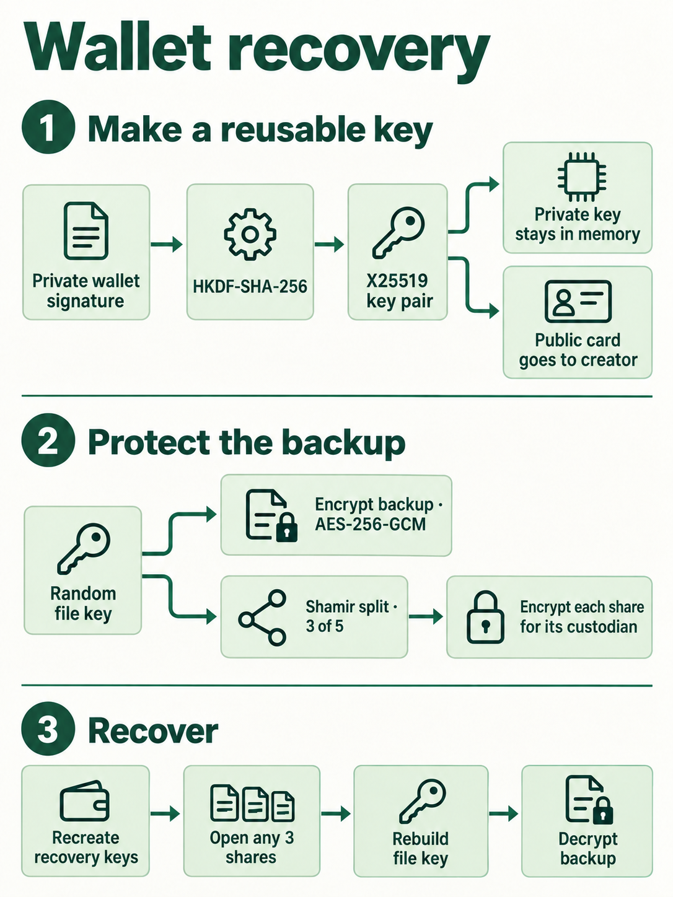

# Protocol and limits

Version 2 research integration: reusable wallet-derived public cards, with version 1 recovery compatibility. Project paths updated 25 September 2026. [Heirs setup](../../index.html#heirs) · [Recovery](../../index.html#recover-heirs). This document describes the implementation in developer/wallet-recovery, not a standardized recovery format or an audited product.

## The construction

Ethereum addresses alone cannot encrypt this package. Custodians first enroll their derived public encryption keys. The creator then needs only these public keys to make future packages without a new signing request or invitation exchange. A fresh file key, Shamir split, nonces, and ephemeral keys are generated for every package.

There is one encrypted payload and one encrypted share per custodian, rather than one package for every combination. The default is 3-of-5; the implementation accepts 2–10 distinct accounts with a threshold of 2 up to the total.

## Signature-derived encryption keys

New cards use the fixed key scheme `Greenbox/reusable-wallet-key/v2`. There is no random recovery context to exchange. The same account, signing method, protocol version, and reproducible signature recreate the same encryption key. File contents, backup labels, recipients, and thresholds are not inputs to this derivation.

EIP-712 uses domain name `Greenbox PRIVATE Reusable Recovery Key`, version `2`, chain ID `1`. Its primary type is `GreenboxReusableRecoveryKey`, with ordered fields `purpose: string`, `keyScheme: string`, and `custodian: address`. The purpose is the fixed `REUSABLE_PURPOSE` string in `src/crypto.mjs`; it explicitly states that this private key is reused across backups. The key scheme is the constant above and custodian is the lowercase account.

`personal_sign` uses five UTF-8 lines, joined by one newline with no trailing newline: `GREENBOX PRIVATE REUSABLE RECOVERY KEY`, `Protocol version: 2`, `Key scheme: Greenbox/reusable-wallet-key/v2`, `Ethereum account: ` followed by the lowercase account, and the same fixed purpose. These exact strings are protocol inputs, not editable copy. The application reconstructs messages from validated fields; it does not accept an arbitrary signing request from an imported file.

Every signature is verified against the expected account. The prototype supports 65-byte ECDSA signatures from individual accounts. It normalizes low/high-S and v=0/1 versus v=27/28, then uses the normalized 64-byte r||s as HKDF input:

- HKDF-SHA-256 salt: SHA-256 of the UTF-8 key scheme string, used as 32 raw bytes.
- Info: `Greenbox/wallet-derived-X25519/v2/` + method + `/` + lowercase account.
- Output: 32 bytes used as an X25519 private key.

Enrollment requests the private signature twice and compares the resulting encryption public keys. A genuinely different ECDSA nonce can produce a valid but different key; enrollment rejects that case. Normalization handles equivalent encodings only. It cannot make randomized signatures deterministic.

The third signature is a **separate public registration proof**, with its own domain/purpose. For new cards its EIP-712 domain is `Greenbox PUBLIC Reusable Key Registration`, version `2`, chain ID `1`, and primary type `GreenboxReusableRegistration`. It binds purpose, key scheme, account, signing method, and public encryption key. The readable alternative starts `GREENBOX PUBLIC REUSABLE KEY REGISTRATION` and binds the same fields. It is safe to include this proof in public artifacts under the protocol's assumptions. The private derivation signature is never exported. Reusing that private signature as the public proof would expose the encryption key; this implementation explicitly separates the two messages.

No time, nonce, hostname, browser origin, or expiration is added to the private signing request. These would change the derived key. As a consequence, another site can reproduce the request. Signing that exact private message on a malicious site gives that site the power to open your share in every package using that key, including future packages. The same scope applies to theft of the derived private key. This reuse tradeoff is intentional; other shares are still required to reach the threshold. EIP-712 domain names are not a website authentication mechanism.

## File and share protection

- Random 32-byte file key, AES-256-GCM, fresh 12-byte nonce, 128-bit tag.
- The canonical package header is authenticated additional data. For version 2 it includes the suite, backup label, random package ID, threshold, recipients, and original file metadata.
- Privy's `shamir-secret-sharing` splits the file key using GF(256). This implementation produces 33-byte shares for a 32-byte secret, including the library's coordinate byte.
- Each share gets a fresh ephemeral X25519 key pair. ECDH with the custodian's registered public key feeds HKDF-SHA-256.
- Share HKDF salt is SHA-256 of the canonical header. Its info and AES-GCM additional data bind the header digest, encrypted-payload digest, recipient account, recipient public key, recipient index, ephemeral public key, and purpose `Greenbox/share-wrap/v1`.
- Each share has a public SHA-256 commitment. This detects an incorrect or corrupted released share. The final file's AES-GCM tag independently authenticates the reconstructed file key and plaintext.
- Canonical JSON recursively sorts object keys while preserving array order. All protocol strings and fields are explicitly constructed/validated. Each format and the cryptographic suite are versioned.

A version 2 public receipt stores the package ID and SHA-256 of the entire canonical package. The app refuses to release or combine shares without a matching receipt and a source confirmation. **The receipt is not an owner signature.** Trust comes from its separate delivery or trusted storage. Replacing both package and receipt defeats this identity check. Recipient registration proofs bind individual keys, not the creator's intent or human identities.

A released contribution contains one raw share, account/index, package ID, and receipt fingerprint. It is a transferable secret and does not expire. Any threshold of matching contributions can recover without further wallet interaction. There is no revocation of already copied packages/shares and no enforced waiting period or inheritance event.

## Compatibility and updates

New cards, packages, and receipts use `greenbox.wallet.custodian/2`, `greenbox.wallet.package/2`, and `greenbox.wallet.receipt/2`. The underlying file/share encryption suite remains `X25519-HKDF-SHA256-AES256GCM-SSS-GF256-v1`; those primitives and wrapping contexts have not changed. Contributions retain `greenbox.wallet.contribution/1` because their existing package ID and fingerprint already bind them to one exact package.

Version 1 cards contain their original invitation, including the random recovery ID. Their exact private/public messages, signatures, HKDF salt (recovery ID bytes), and info prefix `Greenbox/wallet-derived-X25519/v1/` remain unchanged. Version 1 packages and receipts still require their original format and matching recovery ID. Compatibility is checked against a fixture produced before the version 2 code change, and the previously downloaded browser package/shares.

A version 2 package accepts either card version, including legacy cards from different invitation contexts. Each recipient's card supplies its own recipe for recreation. The user no longer imports, creates, or distributes an invitation file. The tool rejects unknown formats and schemes instead of guessing.

The creator can import saved cards individually or load the validated recipient cards from an existing package. This convenience does not authenticate the intended selection: confirm the full account addresses independently before encrypting. No creator wallet or custodian signing is required to build a new package with existing cards. File keys, split shares, nonces, ephemeral keys, package IDs, and receipts are fresh for each new package. Contributions from an older package cannot recover the new package.

An older card and a new reusable card for the same wallet may derive different keys. A new card does not update or repair an older package. Keep the original card and updated tool; recovery selects the original recipe automatically. An old HTML tool will not recognize version 2 files. Restore checks must use the original card, not a freshly enrolled replacement.

## Files and secrecy

| File | Secret? | Keep / send to |
|---|---|---|
| Reusable public key card | No | Creator for future backups; custodian for restoration checks |
| Encrypted package | Ciphertext, but metadata is public | Redundant storage and custodians |
| Public receipt | No; its authenticity matters | Separate trusted delivery/storage |
| Released share | **Yes** | Recovering person, privately |
| Recovered file | Treat as sensitive | Recovering person |
| Private derivation signature/key | **Yes** | Memory only inside the trusted page |

The package includes a backup label, account addresses, public encryption keys, public registration signatures, threshold, filename, size, and MIME type. It is not metadata-private. A single file up to 32 MiB is supported; no compression or archive extraction occurs. A recovered filename is sanitized before download, and recovered content is downloaded as binary rather than executed or displayed in the page.

## Wallet and Trezor compatibility

Provider discovery uses EIP-6963, with a legacy injected-provider fallback. The user selects Rabby or MetaMask explicitly. No RPC URL, API key, WalletConnect relay, blockchain transaction, token approval, or network-based account lookup is needed by the page. It uses `eth_requestAccounts`, `eth_accounts`, `eth_chainId`, `eth_signTypedData_v4`, and, when explicitly selected, `personal_sign`.

Trezor Safe 3, 5, and 7 are approached through the account paired in the extension. The page cannot identify or attest the physical device behind a provider. Trezor's Connect API provides typed-data signing, but the extension path determines what the page can request. MetaMask's current documentation specifies `personal_sign` for Trezor hardware accounts; choose **Readable message** for that path. Rabby typed signing is conditional on its installed integration and has not been physically verified here. [MetaMask signing reference](https://docs.metamask.io/metamask-connect/evm/guides/sign-data/). Safe 7 requires a sufficiently recent integration; Trezor documents Connect 9.6.0+ and Suite requirements. No physical Safe 3/5/7 was exercised during this implementation.

EIP-712 standardizes the signed data, not deterministic signature output. A same-device two-sign check does not establish reproducibility after restoration, firmware changes, or switching wallet implementations. Test with dummy material and a restored/spare account before relying on this design. Retain the original public card and software version details. A key mismatch fails closed and never silently registers a replacement key for an old package.

Contract wallets such as Safe multisigs and EIP-1271 signatures are unsupported. Ethereum EOA signatures and X25519 are classical cryptography. This recovery route is **not post-quantum**, even if the recovered bundle contains an age post-quantum identity.

## Local execution and threat model

`recovery.html` bundles all JavaScript and styles. The production entry point contains no practice provider, wallet generator, embedded sample database, or sample password. Development fixtures live under `developer/wallet-recovery/tests/fixtures/` and are not bundled or served. The build rejects application modules outside the production source allowlist; the release test also checks the generated HTML. There are no runtime CDN dependencies, analytics, remote fetches, browser-storage writes, or application uploads. The CSP allows only the exact inline script/style hashes and disallows network connections. The local server binds 127.0.0.1 and serves only the handbook and recovery tool; it does not serve the folder or accept uploads.

Wallet extensions, Trezor Suite, and operating-system services have independent network behavior. The page does not make a compromised computer or extension trustworthy. Encryption keys derived from a hardware signature exist in the browser's memory; hardware seed isolation does not also keep those derived keys inside the device.

Sensitive byte arrays are overwritten when practical, but immutable signature strings, intermediate copies, browser memory, crash reports, downloaded shares, and OS memory management prevent a guarantee of erasure. Do not interpret “Clear session” as secure deletion of downloads or memory.

Public account proofs, authenticated encryption, strict versions/shapes, size bounds, duplicate detection, account-change checks, and a trusted receipt address mistakes and several tampering cases. They do not constitute a formal security proof or an independent audit of this composition. HKDF applied to a reproducible ECDSA signature is a design choice with additional assumptions beyond the EIP-712 standard. Wallet-signature derivation also concentrates each custodian's backup access under the same wallet recovery material.

Use this as a compatibility and usability rehearsal. Keep Greenbox's existing owner/passphrase route; memory-only owner recovery is not solved by this custodian prototype. Any three custodians can cooperate now, including against the owner's wishes. A new package cannot revoke retained copies of an old one.

## Dependencies and rebuild

Pinned dependencies: ethers 6.17.0, @noble/curves 2.4.0, shamir-secret-sharing 0.0.4; build dependency esbuild 0.28.2. The SSS library has published independent audits; those audits do not cover this application. Browser Web Crypto supplies randomness, SHA-256, HKDF, and AES-GCM.

The existing HTML needs no dependency installation to run. Build and test instructions are in `developer/README.md`. Node.js 20.19.0 or newer is required by the pinned noble-curves package. `developer/wallet-recovery/package-lock.json` records dependency integrity hashes. Installing dependencies requires network access; the tests and build then run locally. The local server does not import node_modules and must be allowed to bind loopback. `developer/checks/wallet-build.json` identifies the built HTML by SHA-256; retain that manifest through a trusted channel if using it to check copies.

## Primary sources

- [EIP-712 specification](https://eips.ethereum.org/EIPS/eip-712) — typed data and domain separation; no deterministic signature guarantee.
- [EIP-6963 specification](https://eips.ethereum.org/EIPS/eip-6963) — discovery of multiple injected wallets.
- [Trezor Ethereum typed-data signing](https://connect.trezor.io/9/methods/ethereum/ethereumSignTypedData/) — device API capability; not proof that every extension path supports it.
- [Rabby and Trezor](https://trezor.io/guides/third-party-wallet-apps/ethereum-evm-apps/rabby-wallet-and-trezor) and [MetaMask and Trezor](https://trezor.io/guides/third-party-wallet-apps/ethereum-evm-apps/metamask-and-trezor) — pairing through third-party wallets.
- [Trezor Connect](https://trezor.io/guides/trezor-devices/trezor-fundamentals/trezor-connect) — current Safe 7 integration requirements.
- [Privy Shamir library, source and audit references](https://github.com/privy-io/shamir-secret-sharing) — input validation and integrity remain the caller's responsibility.
- [RFC 6979](https://www.rfc-editor.org/rfc/rfc6979) — deterministic ECDSA; this is not mandated by EIP-712.
- [RFC 5869](https://www.rfc-editor.org/rfc/rfc5869) — HKDF extract-and-expand.
