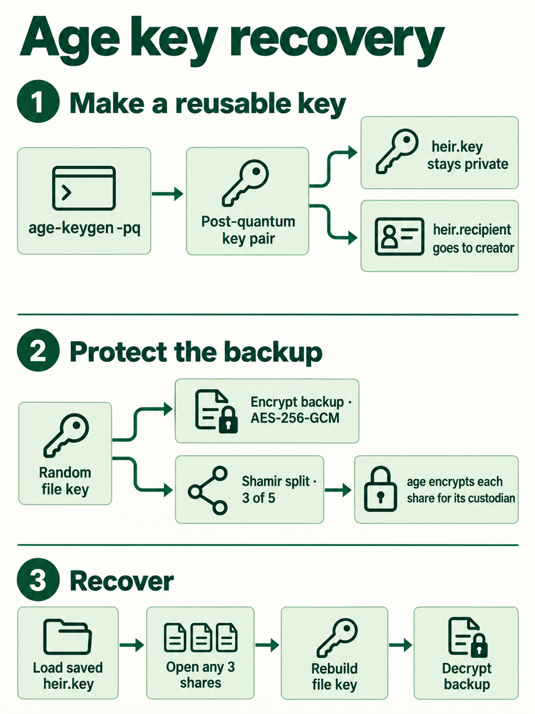

# Age recovery protocol

Current format: `greenbox.age.package/1`. This is a Greenbox integration, not a standardized threshold age format or independently audited product. Older wallet packages require their previous tool; see [Legacy recovery](../../index.html#help!legacy-recovery).

## How it works



Each heir creates a native hybrid post-quantum age identity with `age-keygen -pq`. They retain the private key and send the creator its public recipient. The creator reuses these recipients across backups, with no enrollment message, wallet, invitation, or signature.

The application accepts 2–10 distinct recipients, with a threshold from 2 to the total. Every package contains one encrypted payload and one separately encrypted Shamir share for each heir. Any threshold of different shares recovers the payload, in any order.

Putting several recipients on a single ordinary age file gives **any one** of them access. Greenbox instead encrypts each Shamir share to exactly one recipient to implement the threshold.

## Reproducibility and storage

Key generation is random, not deterministic. Reproducible recovery comes from keeping and restoring the exact private key file. Deriving the public recipient from the same private identity is stable and interoperable with the age command-line tool. No wallet signing implementation participates.

An heir can run:

```sh
age-keygen -y -o heir.recipient heir.key
```

The application accepts one unencrypted native PQ identity per key file, allowing age-keygen comments and blank lines. It does not accept classical identities, hardware plugins, or encrypted identity files directly. Decrypt an encrypted identity locally with age before using it in the browser, or use age to decrypt the exported share without loading the key into the browser.

Protect private-key backups independently of the Greenbox they help recover. Loss of a key loses that heir’s access to all its shares. Exposure gives an attacker that heir’s access to all packages using the recipient. A new key requires new packages; it cannot revoke retained old ciphertext.

## Cryptographic construction

1. Generate a fresh random 32-byte payload key and 12-byte nonce using the platform CSPRNG.
2. Encrypt the payload with AES-256-GCM and a 128-bit authentication tag. Authenticate the complete canonical header as additional data.
3. Split the key using `shamir-secret-sharing` 0.0.4 over GF(256). Each share is 33 bytes: the 32-byte secret share and the library’s coordinate byte.
4. Compute a context digest: SHA-256 of canonical JSON containing `{header, payload}`.
5. For every heir, create a contribution object binding the package ID, context digest, recipient fingerprint, 1-based index, and base64 share.
6. Encrypt that object as a standard age file with **one** hybrid ML-KEM-768 + X25519 recipient, using `age-encryption` 0.3.1. Store the base64 age file and a SHA-256 commitment to the raw share.
7. Create the receipt containing the package ID and SHA-256 of the entire canonical package.

Canonical JSON sorts object keys lexicographically, preserves array order, and otherwise uses JSON string/number encoding. Hashes and identifiers use lowercase hex without a prefix. Binary fields use padded standard base64. The parser rejects unexpected fields, invalid key checksums, unsupported formats, duplicate recipients, and invalid size/threshold values.

The share context intentionally excludes the encrypted envelopes, avoiding a circular hash dependency. The separately trusted receipt covers all envelopes as well as the header and encrypted payload. Altering the payload or header invalidates existing contributions. Altering an envelope invalidates the receipt; age also authenticates its encrypted contents.

## Files

| File | Contents |
|---|---|
| `heir.recipient` | Ordinary text age public recipient; not a Greenbox JSON card |
| `heir.key` | Native private age identity; never exported by the app |
| `greenbox-package.json` | Format, header, encrypted payload, encrypted shares and share commitments |
| `greenbox-receipt.json` | `greenbox.age.receipt/1`, package ID, package fingerprint |
| `share-N.age` | Standard age envelope exported from the package |
| Released share JSON | `greenbox.age.share/1`, package ID, context, recipient ID, index and secret share |

The header includes the suite, random 32-byte package ID, backup label, threshold, public recipients with labels and SHA-256 fingerprints, and original filename, size and MIME type. Labels, public keys, file metadata, and threshold are public. Payloads are limited to 32 MiB; the UI caps JSON imports at 48 MiB.

## Recovery and validation

The heir first checks the complete package against an independently trusted receipt. The tool derives their public recipient from their saved private identity, selects their encrypted share, and decrypts it with age. It then verifies the decrypted contribution’s package/context/recipient/index binding and share commitment.

Alternatively, export the corresponding `.age` file and use age 1.3+:

```sh
umask 077
age -d -i heir.key -o share-1.json share-1.age
```

The recovering person imports distinct contributions from the same package. Greenbox validates every contribution, combines the threshold number, and authenticates/decrypts the payload with AES-GCM. The package’s original filename is used for the download, with unsafe filename characters replaced.

For a full owner kit, that payload is `bundle.tar`. Its `master.key` decrypts the vault and `verify.pub` checks its minisign signature. A directly protected KeePass database still needs its own KeePass password and any key file.

## Trust and limits

- Public recipients need a trusted exchange or fingerprint comparison with the intended heir. Names in filenames do not authenticate people.
- The receipt is a fingerprint, **not a signature**. Anyone can create a replacement package and matching receipt. Keep the original receipt through a trusted route.
- Hybrid age recipients protect against either classical or post-quantum key-agreement failure, under their respective assumptions. The age format still uses a **128-bit internal file key**. The AES-256 payload layer does not increase the security of the weaker enclosing route. This is not a claim of 256-bit post-quantum security throughout.
- The independent owner route depends on passphrase strength and its password KDF. Minisign uses classical Ed25519 signatures. Calling the entire kit “quantum proof” would be inaccurate.
- Any threshold of heirs can recover at any time. This is not an inheritance date gate, revocation system, or verifiable secret sharing protocol.
- Local execution avoids sending files to a service; it does not protect against a compromised computer or malicious replacement HTML. Use a reviewed local copy for real keys.
- The app has no network requests, external runtime scripts, browser storage, or wallet APIs. Private inputs are short-lived local variables; secret byte buffers are cleared where practical. JavaScript garbage collection prevents guaranteed memory erasure.
- A missing encrypted package cannot be reconstructed from keys alone. Public availability, discovery, freshness and storage must be tested separately.

## Updating and migrating

For unchanged recovery keys, a new `vault.age` and signature can reuse the same owner and heirs wrappers. To protect changed bundle contents, generate a new package and receipt using the same heir recipients. The heirs do not need new keys. Every new package gets fresh random cryptographic material, and old released shares are rejected against it.

Wallet packages from the initial release are intentionally rejected with a legacy recovery message. Retrieve the exact old tool from commit `cd25eb09a1e025740562b3b3afb3d568e9f07a69`, recover using the original signing setup or use the owner route, then create an age package. No old-wallet functionality is bundled into the current app.

## Sources

- [age post-quantum keys](https://github.com/FiloSottile/age#post-quantum-keys)
- [age format specification](https://c2sp.org/age@v1.1.0)
- [age TypeScript implementation](https://github.com/FiloSottile/typage)
- [Shamir library and its audit information](https://github.com/privy-io/shamir-secret-sharing)
- [NIST FIPS 203: ML-KEM](https://csrc.nist.gov/pubs/fips/203/final)
